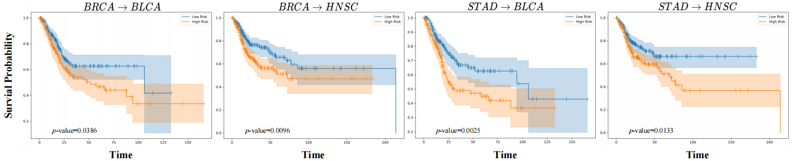

# MCCSDG


Official PyTorch implementation of the ACM MM 2025 paper **Single Domain Generalization for Multimodal Cross-Cancer Prognosis via Dirac Rebalancer and Distribution Entanglement**

* New Task: Single Domain Generalization + Multimodal prognosis
* Key words: "Domain Generalization", "Multimodal Learning"


## Dataset

Preprocessed multimodal prognosis data: TCGA [[Baidu Disk](https://pan.baidu.com/s/1IsGPdd1qqBS4xHS-Cgep8g?pwd=kekn)]

* If you use our preprocessed dataset, we kindly ask you to **cite** both **our paper and the original source of the data**. This dataset can be directly applied to the **new task** proposed in this work: **cross-cancer single domain generalization**, as well as to **traditional multimodal prognosis tasks**.

## Easy to Use!

* For implementation, the difference between achieving generalization with MixStyle and conducting multi-modal learning of pathological image features and genetic features is very small. In addition to mapping the two modalities into the same dimension through a neural network, MCCSDG simply adds a modality mask and adjusts the mixing strategy to the existing method. This is all we need to convert a unimodal robust feature learning method (e.g., MixStyle) into a multimodal robust feature learning method, and deliver all the magic. The **core code** is shown as follows.

* [**Plug-and-play**] [Input: f1, f2] [Output: f1, f2] 

```
class MCCSDG(nn.Module):
    """
    Implements feature masking and distribution entanglement for robust multimodal representation learning.
    
    Input tensor shapes:
    - f1: [B, N1, D] where B is batch size (usually 1), N1 is number of features for modality 1, D is feature dimension
    - f2: [B, N2, D] where B is batch size (usually 1), N2 is number of features for modality 2, D is feature dimension
    
    Example:
    - f1 (omic features): [1, 331, 256] - 1 sample, 331 omic features, 256-dim features
    - f2 (wsi features): [1, 4096, 256] - 1 sample, 4096 wsi features, 256-dim features
    """
    def __init__(self, p_aug=0.3, alpha=0.1, p_mask=0.5, eps=1e-6):
        super().__init__()
        assert 0 <= p_mask < 1, "p_mask must be in [0, 1)"
        self.p_aug = p_aug
        self.p_mask = p_mask
        self._beta_dist = torch.distributions.Beta(alpha, alpha)
        self._eps = eps
        self._alpha = alpha
        self._enabled = True

    def __repr__(self):
        return f'MCCSDG(p_aug={self.p_aug}, p_mask={self.p_mask}, alpha={self._alpha}, eps={self._eps}, mode={self._mode})'

    def set_enabled(self, status=True):
        self._enabled = status

    def set_mode(self, mode='random'):
        self._mode = mode

    def feature_masking(self, f):
        """
        Apply feature masking to input tensor f.
        
        Args:
            f: Input tensor of shape [B, N, D] where:
               - B: batch size (usually 1)
               - N: number of features for this modality
               - D: feature dimension
        
        Returns:
            f_masked: Masked tensor of same shape [B, N, D]
        """
        if not self.training:
            return f
        mask_prob = torch.rand(f.size(1), device=f.device)  # [N]
        threshold = self.p_mask
        mask_vec = mask_prob >= threshold
        if not mask_vec.any():
            mask_vec[0] = True
        
        mask_vec = mask_vec[torch.randperm(mask_vec.size(0))]
        
        mask_expanded = mask_vec.unsqueeze(0).unsqueeze(-1).expand_as(f)  # [B, N, D]
        
        f_masked = f * mask_expanded.float()
        return f_masked

    def feature_entanglement(self, f1, f2):
        """
        Apply feature distribution entanglement between two modalities.
        
        Args:
            f1: Input tensor of shape [B1, N1, D] where:
                - B1: batch size for modality 1 (usually 1)
                - N1: number of features for modality 1
                - D: feature dimension
            f2: Input tensor of shape [B2, N2, D] where:
                - B2: batch size for modality 2 (usually 1)
                - N2: number of features for modality 2
                - D: feature dimension (same as f1)
        
        Returns:
            f1_out, f2_out: Entangled tensors of same shapes as inputs
        """
        if not self.training or not self._enabled:
            return f1, f2
        if random.random() > self.p_aug:
            return f1, f2

        f1_mean = f1.mean(dim=2, keepdim=True)
        f1_variance = f1.var(dim=2, keepdim=True)
        f1_stddev = (f1_variance + self._eps).sqrt()

        f2_mean = f2.mean(dim=2, keepdim=True)
        f2_variance = f2.var(dim=2, keepdim=True)
        f2_stddev = (f2_variance + self._eps).sqrt()

        f1_mean_detached, f1_stddev_detached = f1_mean.detach(), f1_stddev.detach()
        f2_mean_detached, f2_stddev_detached = f2_mean.detach(), f2_stddev.detach()


        f1_normed = (f1 - f1_mean_detached) / f1_stddev_detached
        f2_normed = (f2 - f2_mean_detached) / f2_stddev_detached

        N1, N2 = f1.size(1), f2.size(1)
        blend_coeff1 = self._beta_dist.sample((N1,)).to(f1.device)  # [N1]
        blend_coeff2 = self._beta_dist.sample((N2,)).to(f2.device)  # [N2]

        idx1 = torch.randperm(N1)
        idx2 = torch.randperm(N2)

        blend_coeff1_expanded = blend_coeff1.unsqueeze(0).unsqueeze(-1)  # [1, N1, 1]
        blend_coeff2_expanded = blend_coeff2.unsqueeze(0).unsqueeze(-1)  # [1, N2, 1]


        f1_blended_mean = f1_mean_detached * blend_coeff1_expanded + f2_mean_detached[:, idx2 % N1, :] * (1 - blend_coeff1_expanded)
        f1_blended_std = f1_stddev_detached * blend_coeff1_expanded + f2_stddev_detached[:, idx2 % N1, :] * (1 - blend_coeff1_expanded)

        f2_blended_mean = f2_mean_detached * blend_coeff2_expanded + f1_mean_detached[:, idx1 % N2, :] * (1 - blend_coeff2_expanded)
        f2_blended_std = f2_stddev_detached * blend_coeff2_expanded + f1_stddev_detached[:, idx1 % N2, :] * (1 - blend_coeff2_expanded)

        f1_out = f1_normed * f1_blended_std + f1_blended_mean
        f2_out = f2_normed * f2_blended_std + f2_blended_mean

        return f1_out, f2_out

    def forward(self, f1, f2):
        """
        Forward pass of MCCSDG.
        
        Args:
            f1: Input tensor of shape [B1, N1, D] (modality 1 features)
            f2: Input tensor of shape [B2, N2, D] (modality 2 features)
        
        Returns:
            f1_out, f2_out: Processed tensors of same shapes as inputs
        """
        f1 = self.feature_masking(f1)
        f2 = self.feature_masking(f2)
        f1, f2 = self.feature_entanglement(f1, f2)
        return f1, f2
```



* train

```
bash ./smalltrain.sh
```

* test

```
bash ./test_specific.sh
```

## Citation :heart_eyes: :fire:

If you find this repo useful for your research, please consider citing the paper as follows:
```
@inproceedings{jiang2025mccsdg,
  title={Single Domain Generalization for Multimodal Cross-Cancer Prognosis via Dirac Rebalancer and Distribution Entanglement},
  author={Jiang, Jia-Xuan and Liu, Jiashuai and Wu, Hongtao and Wu, Yifeng and Wang, Zhong and Bi, Qi and Zheng, Yefeng},
  booktitle={Proceedings of the 33rd ACM International Conference on Multimedia},
  year={2025}
}
```

## Acknowledgment :sparkles:
This code is based on implementations by [SurvPath](https://github.com/mahmoodlab/SurvPath) and [MixStyle](https://github.com/KaiyangZhou/mixstyle-release).
